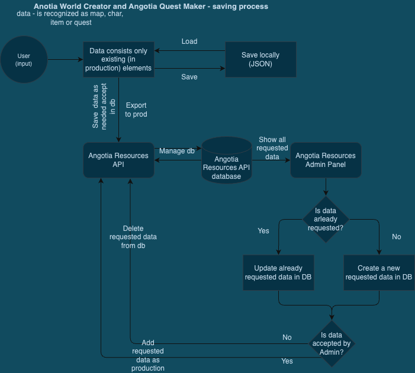

# Angotia World Creator

Angotia World Creator *(AWC)* is tool for game developers or World Creators to creating fully functionally boards and characters for Angotia game. AWC provides professional UI and rapid work from browser everywhere. 

## Purpose of Angotia World Creator
1. Provides a tools to create Mobs, NPCs, Maps, Items and so on for Game Creators or game players
2. Each resource in AWC can be prompt to be added to production environemt of the game. It creates the feel of "living game", where a new maps and another sources are added in the meantime. Also it build a confident around the players that they are making the game

## Run everywhere
AWS works in the most modern browsers, like:
1. Google Chrome
2. Mozilla Firefox
3. Safari
4. Edge
5. Opera

## Multi language
AWS provides the interface in the following languages:
1. English
2. Polish
3. French *(partial)*

## Technology behind the Angotia World Creator
### Frontend & related
- **React** - Fast and easy library for UI.
- **Redux** - Application state management tool. I chose it naturally, because Redux has a brilliant support for a huge projects.
- **I18n** - Tool for internalization with the most community and functionalities.
- **Localstorage** - A natural choice to store the data between browser sessions.
- **HTML5 Canvas** - Built-in solution for paiting canvases.
- **TypeScript** - I need to keep the data and types consistent.
- **Apollo** - Consuming Angotia Resources API

### Authentication
- **Keycloak** - I chose it because of the many customisation options and the ability to self-host so as not to be tied to one service provider.

### Others
- **Angotia SDK** - It is a Software Development Kit created from scratch that provides common functions between Angotia microservices, such as contract, interfaces, tools and so on. I create it to do not copy same utils and data between microservices, and to have a singile source of truth in terms of contract, interfaces.

## Core concepts of Angotia World Creator

### Saving & approving new products flow

## Set up
1. Clone repository
2. `npm i` in root directory
3. Publish all local packages (e.g poyters-components)
4. `npm run yalc:add` to connect pull Angotia SDK from yalc sources

